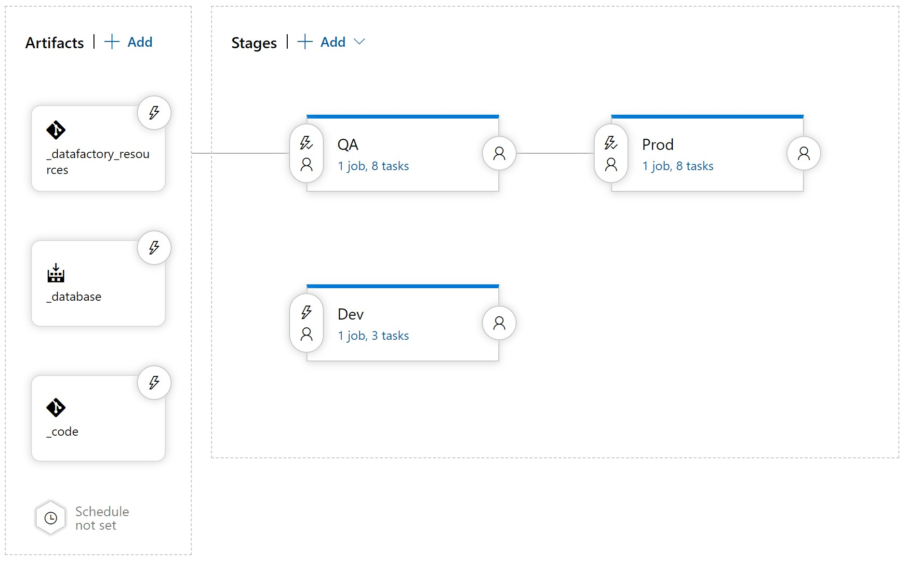
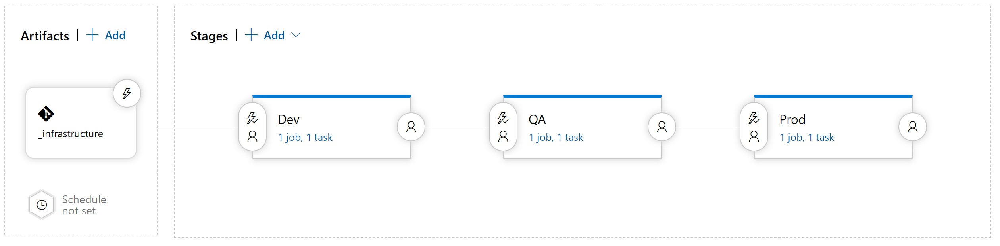
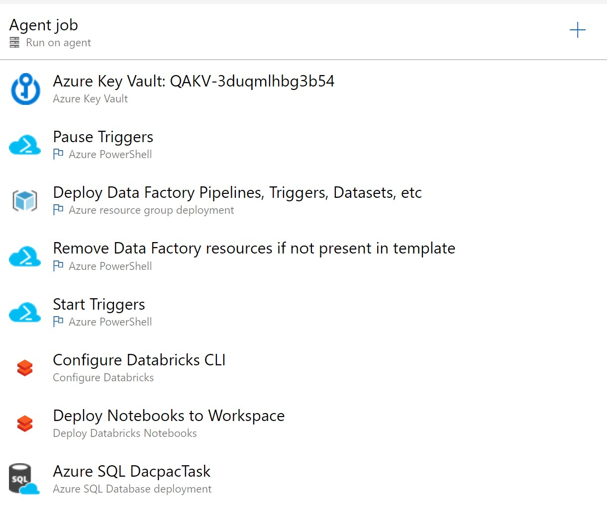
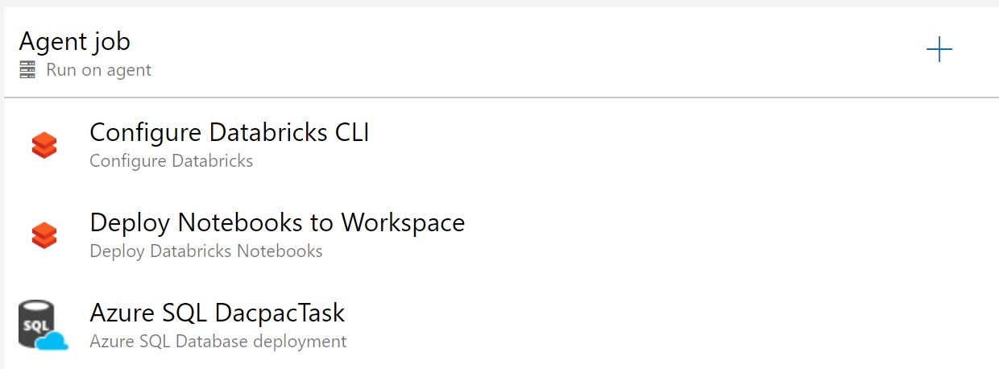

# Data Estate DevOps

<p align="center">
  
</p>

This repository provides sample code and instructions for creating a DevOps pipeline for Azure Data Factory, a SQL database project, and Databricks Notebooks.  Included in this repo are:

* Infrastructure (ARM Templates) for Azure resources supporting a set of ETL jobs.
* Azure Data Factory Resources including pipelines, linked services, datasets, etc.
* A sample databricks notebook
* A sample SQL Database solution for SQL Server Data Tools

## Table of Contents

* [SQL Build Pipeline](#sql-build-pipeline)
* [Release Data Estate Infrastructure](#release-data-estate-infrastructure)
* [Release ADF Pipeline, SQL, and Databricks](#release-adf-pipeline-sql-and-databricks)
* [Manual Steps](#manual-steps)


## Instructions

In Azure DevOps, you'll need to [import this git repository](https://docs.microsoft.com/en-us/azure/devops/repos/git/import-git-repository?view=azure-devops) into your repo.  This allows you to essentially fork this repo and experiment with changing the folders, adding files, etc.

With that step done, follow the steps below to create your build and release pipelines.

### SQL Build Pipeline

The SQL Build Pipeline will create a SQL Data-Tier Application file that can be deployed to your Azure SQL DB.  The solution file is generated using SQL Data Tools in Visual Studio.

**Steps:**

* Create a new Build pipeline.
* Select "Classic Editor"
* Select Azure Repos Git and choose the appropriate Team Project and repository name.
  * Default branch should be master.
* Select Empty Job
* Add the "MSBuild" Task to Agent job 1
  * Set Project to `sqldb/etldb/etldb.sln`
  * Leave all other fields as default.
* Add Copy Files task to Agent job 1 after the MSBuild task.
  * Change Source Folder to `$(agent.builddirectory)\s`
  * Change Contents to `**\bin\**`
  * Change Target Folder to `$(build.artifactstagingdirectory)`
* Add Publish Build Artifacts after the Copy Files task
  * Change Artifact Name to `DBDeployment`
* Save & Queue and you have a succesful build process for your Data-Tier Application!

### Release Data Estate Infrastructure

<p align="center">
  
</p>

This release pipeline will deploy the necessary resources to have a working ETL pipeline.  Including Azure Data Factory, Databricks, SQL DB, Storage Accounts, Key Vault, and several secrets created automatically.  The secrets are: 
* sqlconnstr - the SQL connection string using admin name and password.
* datastoragekey - the Primary Key from the data storage account that would house your landed data.

**Steps:**

* Create an Artifact from the Azure DevOps git repo and name it `_infrastructure`.
* Create three stages: Dev, QA, Prod
* Create variables for each stage (by changing scope to the appropriate stage):
  * **RG_Name**: The resource group name for each stage.
  * **SQLADMINPWD**: The SQL admin password.  Should be set as a secure string.
* Each stage has one task, a **Resource Group Deployment** task
  * Select and Authenticate your Azure Subscription (this creates a Service Principal).
  * Action: Create or update resource group
  * Resource Group: `$(RG_NAME)`
  * Location: Your location of choice
  * Template: `$(System.DefaultWorkingDirectory)/_infrastructure/azuredeploy.json`
  * Deployment Mode: `Incremental`
  * "Override template parameters" for each task with something similar to:
    * objectId is a guid for a service principal you must create in advance (see [manual Steps](#manual-steps) "Authenticating Azure DevOps with your Subscription")

    ```
    -factoryNameRoot "DevFactory" 
    -databricksNameRoot "DevDatabricks" 
    -databricksManagedRoot "DevDatabricksRG" 
    -keyVaultNameRoot "DevKV" 
    -dataStorageNameRoot "DevDataSA" 
    -serverNameRoot "DevSQL" 
    -storageNameRoot "DevSQLSA" 
    -objectId "xxx-xxx-xxxx-xxxx-xxxxx" 
    -administratorLogin "admin" 
    -administratorLoginPassword "$(SQLADMINPWD)" 
    -location "westus2"
    ```

* Save and Create a Release to deploy to the specified resource groups.

### Release ADF Pipeline, SQL, and Databricks

<p align="center">
  
</p>

This release pipeline will deploy the resources and files that make up an ETL pipeline.  Specifically, Azure Data Factory (ADF) Pipelines, ADF Datasets, ADF Linked Services,  Databricks Notebook, and SQL DB Schema Changes.  It uses PowerShell to Stop and Start Triggers at the appropriate point and remove any deleted ADF objects since DevOps (by default) will keep any deployed resource if it's not mentioned in the ARM template.

<p align="center">
  
</p>

* Create an Artifact from the Azure DevOps git repo and name it `_datafactory_resources`.
  * Select the `adf_publish` branch and the latest commit.
* Create an Artifact from the Azure DevOps git repo and name it `_code`.
  * Select the `master` branch and the latest commit.
* Create an Artifact from the Azure DevOps Build and name it `_database`.
* Create two connected stages.  One for QA and one for Prod.
* Create variables for each stage (by changing scope to the appropriate stage):
  * **RG_Name**: The resource group name for each stage.
  * **FACTORY_NAME**: The data factory name for each stage.
* Add the following tasks to each stage:
  * **Azure Key Vault**: Downloading Secrets for DevOps use
    * Select your Azure Subscription and the appropriate stage's Key Vault.
    * Secrets filter should be `databricks-access-token, sqlconnstr`
    * NOTE: This task will likely fail the first time you run it.  See [manual Steps](#manual-steps) "Providing Azure DevOps Key Vault Task with access to your Key Vault" for steps to resolve.
  * **Azure PowerShell**: Stopping Triggers
    * Select your Azure Subscription
    * Set Preferred Azure Powershell Version to `1.0.0`
    * Set the Inline script to be:

    ```
    $triggersADF = Get-AzDataFactoryV2Trigger -DataFactoryName $(FACTORY_NAME) -ResourceGroupName $(RG_NAME)
    $triggersADF | ForEach-Object { Stop-AzDataFactoryV2Trigger -ResourceGroupName $(RG_NAME) -DataFactoryName $(FACTORY_NAME) -Name $_.name -Force }
    ```

  * **Azure Resource Group Deployment**: Deploying Pipelines, Linked Services, etc.
    * Select your Azure Subscription
    * Resource Group should be `$(RG_NAME)`
    * Location should be the location of your resource group.
    * Template should be `$(System.DefaultWorkingDirectory)/_datafactory_resources/DevFactory-zhjxvjgmd3hfa/ARMTemplateForFactory.json`
    * Template parameters should be `$(System.DefaultWorkingDirectory)/_datafactory_resources/DevFactory-zhjxvjgmd3hfa/ARMTemplateParametersForFactory.json`
    * Override template parameters should be updated with appropriate overrides:

    ```
    -factoryName "$(FACTORY_NAME)" 
    -ETLKeyVault_properties_typeProperties_baseUrl "https://<STAGE's KEYVAULT>.vault.azure.net/" 
    -datastorageacct_properties_typeProperties_url "https://<STAGE's STORAGE ACCOUNT>.dfs.core.windows.net/"
    ```

  * **Azure PowerShell**: Removing deleted Pipelines, Linked Services, etc.
    * Select your Azure Subscription.
    * Script Type should be `Script File Path`
    * Script Path should be `$(System.DefaultWorkingDirectory)/_code/util/clean-up.ps1`
    * Set Preferred Azure Powershell Version to `1.0.0`
    * Set Script Arguments as:

    ```
    -armTemplate $(System.DefaultWorkingDirectory)/_datafactory_resources/DevFactory-zhjxvjgmd3hfa/ARMTemplateForFactory.json 
    -ResourceGroupName "$(RG_NAME)" 
    -DataFactoryName "$(FACTORY_NAME)" 
    -predeployment $false
    ```

  * **Azure PowerShell**: Starting Triggers
    * Select your Azure Subscription
    * Set Preferred Azure Powershell Version to `1.0.0`
    * Set the Inline script to be:

    ```
    $triggersADF = Get-AzDataFactoryV2Trigger -DataFactoryName $(FACTORY_NAME) -ResourceGroupName $(RG_NAME)
    $triggersADF | ForEach-Object { Start-AzDataFactoryV2Trigger -ResourceGroupName $(RG_NAME) -DataFactoryName $(FACTORY_NAME) -Name $_.name -Force }
    ```

  * **Configure Databricks**: Set Databricks Token
    * Set Workpace URL to the appropriate Azure Databricks URL (e.g. https://westus2.azuredatabricks.net)
    * Set Access Token to `$(databricks-access-token)`.
    * To generate the token see [manual Steps](#manual-steps) "Creating an Azure Databricks API token must be completed manually".
  * **Deploy Databricks Notebooks**: Copy Notebooks to Databricks
    * Set Notebooks Folder to `$(System.DefaultWorkingDirectory)/_code/notebooks`
    * Set Workspace Folder to `/` this will put any notebook to the root of your workspace.
  * **Azure SQL Database Deployment**: Deploying DacPac file to SQL DB
    * Select your Azure Subscription
    * Set Authentication Type to `Connection String`
    * Set Connection String to `$(sqlconnstr)`
    * Set Deploy Type to `SQL DACPAC File`
    * Set Action to `Publish`
    * Set DacPac File to `$(System.DefaultWorkingDirectory)/_database/DBDeployment/sqldb/etldb/etldb/bin/Debug/etldb.dacpac`

<p align="center">
  
</p>

* (OPTIONAL) Create a Dev Stage that is only set to be released manually
  * A manual release will not be executed unless explicitly ran.
  * Add the following tasks with the same settings as above for the Dev Stage:
  * Configure Databricks
  * Deploy Databricks Notebooks
  * Azure SQL Database Deployment

### Manual Steps
* Authenticating Azure DevOps with your Subscription:
  * When you create a Release Task for Powershell or Resource Group Deployment, you will have to select a Subscription to deploy into.
  * When you do so, Azure DevOps will require you to create a Service Principal with the necessary permissions for deployment.
  * After doing so, all other tasks can use the same service principal / "Service Connection" to work with your subscription(s).
* Providing Azure DevOps Key Vault Task with access to your Key Vault:
  * The first time you run your Key Vault task, it will fail due to a lack of Access Policies for Azure DevOps.
  * When you download the logs for the failed release, you will receive a powershell script to run that will grant access to the DevOps Service Principal.
  * Run the Powershell script locally and then re-run your DevOps pipeline.
* Creating a Service Principal to pass into infrastructure deployment.
  * You will need to create a service principal that gives access to your Key Vault to create secrets.
  * Note the **Object Id** rather than the application id.
* Creating an **Azure Databricks API** token must be completed manually.
  * Follow the [Azure Databricks Instructions](https://docs.microsoft.com/en-us/azure/databricks/dev-tools/api/latest/authentication)
  * Add that token as a secret to your Key Vault for the appropriate stage.
  * Name the secret `databricks-access-token`.
  * Repeat for each Databricks Workspace and each Key Vault.